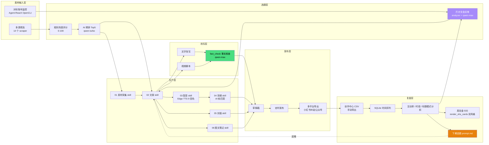

# 6 环节闭环图

> Mermaid 源文件，可直接粘进 GitHub README 或 PPT（用 mermaid 渲染插件）。

## 关键回路

1. **素材→选题→生产→发布**：常规线性链路，由 WorkBuddy 通过 6 个 skill 自动串起
2. **复盘反哺选题**：`analytics` 的 `next_week_prompt.md` 输出回到 `02-script-writer` 的输入，闭环成立
3. **改写前必经 fact_check**：避免编造数字（W17/W21 踩坑总结）

## 与赛题的对应

| 赛题环节 | 本图层级 |
|---|---|
| 素材库构建 | 输入层 |
| 选题生成 | 选题层 + 复盘层反哺 |
| 内容生产 | 生产层 |
| 内容改写 | 改写层 |
| 发布计划 | 发布层 |
| 数据回收分析 | 复盘层 |

## 颜色编码

- 橙色（`#E8820C`）：闭环回路的关键节点（选题反哺）
- 绿色（`#4ADE80`）：质量保障节点（事实核查）
- 紫色（`#A78BFA`）：AI 决策节点（含历史数据驱动）
